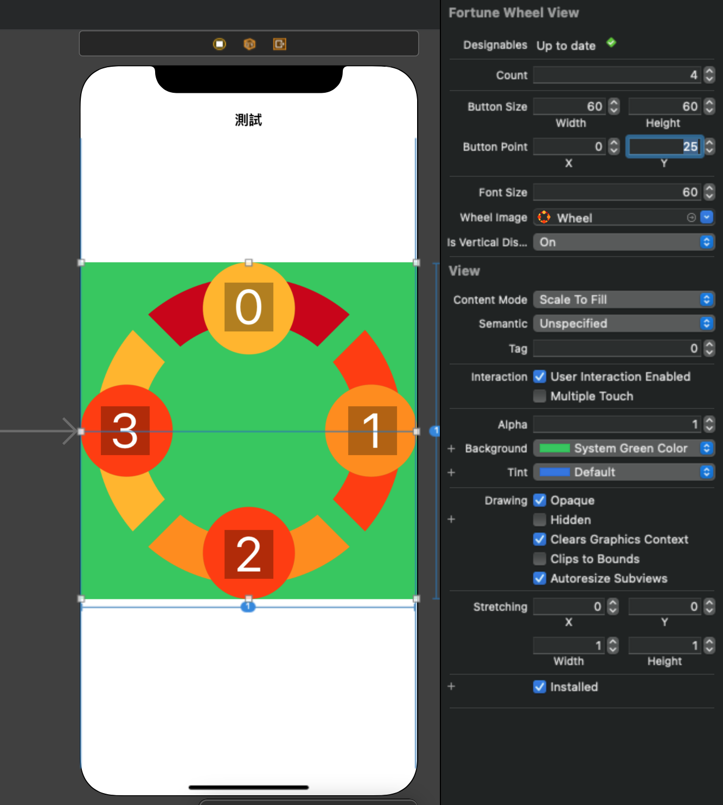

# WWFortuneWheelView
[](https://developer.apple.com/swift/) [](https://developer.apple.com/swift/) [](https://developer.apple.com/swift/) [](https://developer.apple.com/swift/)

A scroll wheel that can be customized.
一個可以自訂數量的滾輪.


### [Installation with Swift Package Manager](https://medium.com/彼得潘的-swift-ios-app-開發問題解答集/使用-spm-安裝第三方套件-xcode-11-新功能-2c4ffcf85b4b)
```
dependencies: [
    .package(url: "https://github.com/William-Weng/WWFortuneWheelView.git", .upToNextMajor(from: "1.0.0"))
]
```


### Example
```swift
import UIKit
import WWFortuneWheelView

final class ViewController: UIViewController {
    
    @IBOutlet weak var myFortuneWheelView: WWFortuneWheelView!
    @IBOutlet weak var indexLabel: UILabel!
    @IBOutlet weak var angleLabel: UILabel!
    
    private let decimalCount: UInt = 3
    
    private var index = 0
    private var angle: (unit: CGFloat, start: CGFloat, end: CGFloat) = (0, 0, 0)
    
    override func viewDidLoad() {
        super.viewDidLoad()
    }
    
    override func viewDidAppear(_ animated: Bool) {
        super.viewDidAppear(animated)
        initSetting()
    }
    
    @objc func didPressed(_ sender: UIButton) { indexLabel.text = "\(sender.tag)" }
}

// MARK: - WWFortuneWheelViewDelegate
extension ViewController: WWFortuneWheelViewDelegate {
    
    func willRotate(_ wheelView: WWFortuneWheelView, unitAngle: CGFloat, startAngle: CGFloat) {
        angle.unit = unitAngle
        angle.start = startAngle
        angleLabel.text = "\(startAngle._decimalPoint(decimalCount))"
    }
    
    func rotating(_ wheelView: WWFortuneWheelView, from startIndex: Int, to endIndex: Int, angle: CGFloat) {
        indexLabel.text = "\(startIndex) to \(endIndex)"
        angleLabel.text = "\(angle._decimalPoint(decimalCount))"
    }
    
    func autoRotated(_ wheelView: WWFortuneWheelView, from startIndex: Int, to endIndex: Int, duration: TimeInterval) {
        indexLabel.text = "\(startIndex) to \(endIndex)"
    }
    
    func didRotated(_ wheelView: WWFortuneWheelView, at index: Int, angle: CGFloat) {
        
        indexLabel.text = "\(index)"
        angleLabel.text = "\(angle._decimalPoint(decimalCount))"

        self.angle.end = angle
        _ = wheelView.bullseyeButtons._isSelected(only: index)
    }
}

// MARK: - 小工具
private extension ViewController {
    
    /// 初始的設定
    func initSetting() {
        
        myFortuneWheelView.myDelegate = self
        myFortuneWheelView.rotateRange = 120...180
        myFortuneWheelView.bullseyeButtons.forEach { button in
            
            let stateImages: [(image: UIImage, state: UIControl.State)] = [
                (image: #imageLiteral(resourceName: "LightOff"), state: .normal),
                (image: #imageLiteral(resourceName: "LightHighlight"), state: .selected),
                (image: #imageLiteral(resourceName: "LightOn"), state: .highlighted),
            ]

            stateImages.forEach { (image, state) in
                button.setImage(image, for: state)
            }
            
            button.setTitle(nil, for: .normal)
            button.addTarget(self, action: #selector(didPressed(_:)), for: .touchUpInside)
        }
    }
}
```
